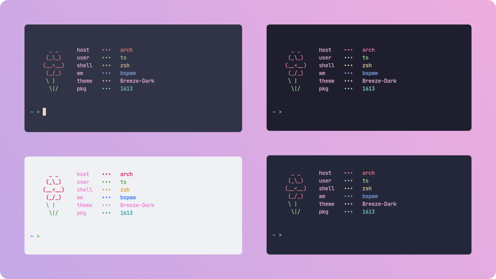
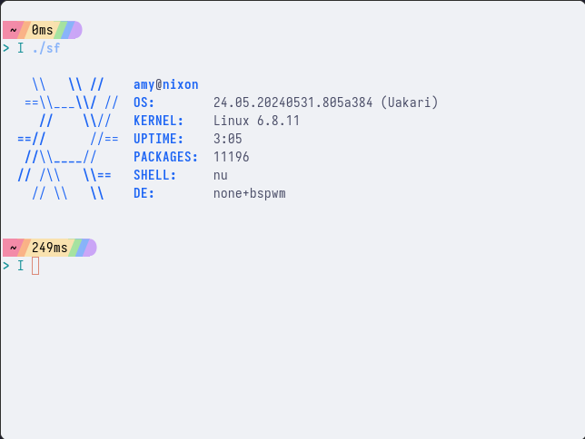
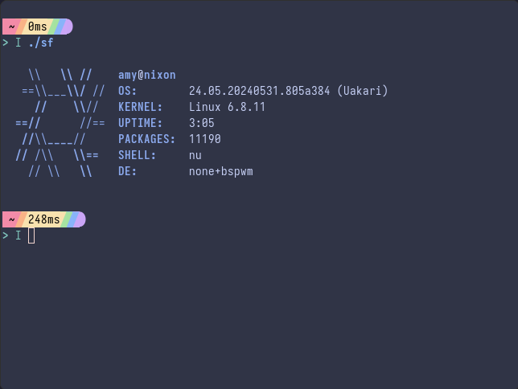
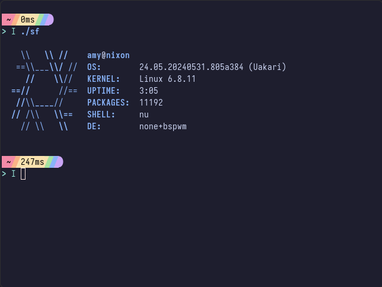

<h3 align="center">
	 
	
	Catppuccin for <a href="https://st.suckless.org/">st</a>
	
</h3>

    
    
    

  

## Previews

🌻 Latte

🪴 Frappé

🌺 Macchiato

🌿 Mocha

## About

This port offers the colors needed for ST's header files, but **not an ST build**.

## Usage

1. Choose your flavour.
2. Copy the contents of `flavour.h` and replace into your st build's `config.h`.
3. Then `make install` it in st folder.

## 💝 Thanks to

- [Jazil T S](https://github.com/tsjazil)

&nbsp;

Copyright &copy; 2021-present <a href="https://github.com/catppuccin" target="_blank">Catppuccin Org</a>

